# Trimr
Trimr is a two-sided service marketplace for barbers and hair-stylists looking to expand their practice beyond the studio and consumers looking to have their barber come to them on their time.

## Technologies Used
* Ruby, v. 2.5.3 (primary programming language)
* Rails (framework)
* Bootstrap (design elements)
* Google Maps API (barber map placement)
* Devise (user authentication)
* Carrierwave (image uploading)
* AWS (image storage)
* Square Appointments

## Interface

After signing up as a registered user of the platform, users may become "barbers" via the "Become a Barber" form.

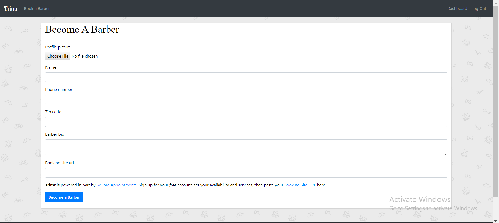

They will then be directed to the barber profile page.

From there, users will be able to customize their barber profile by adding haircut styles and pricing...

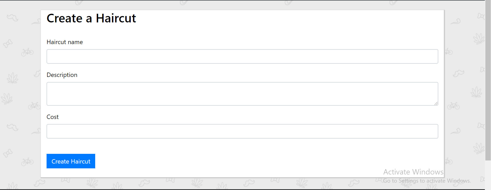

...along with gallery photos of their personal work to establish credibility amongst other users.

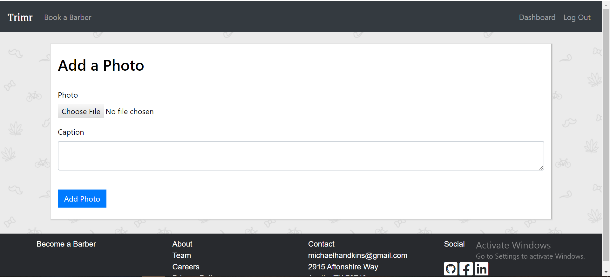

Also from the barber profile page, users may "Book an Appointment" with the selected barber. Choosing to do so redirects the user to the barber's Square Appointments page, via which the user may schedule an appointment with their personal details.

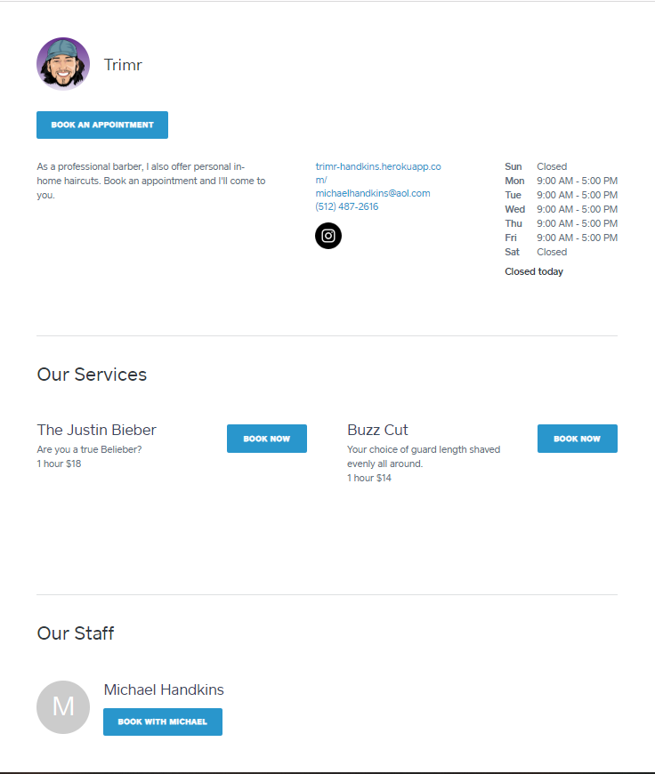
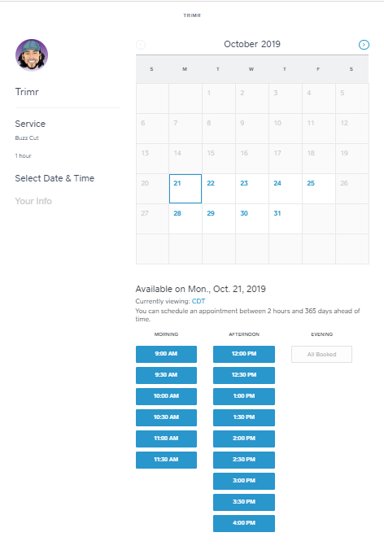

After submitting the appointment details, the user will receive a text letting them know their appointment request is being reviewed...

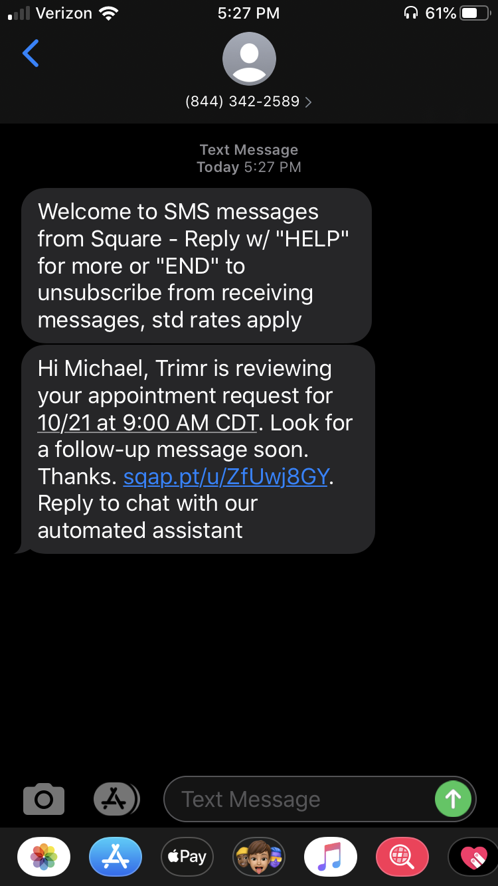

...and the barber will be alerted via text that they have an appointment to confirm.

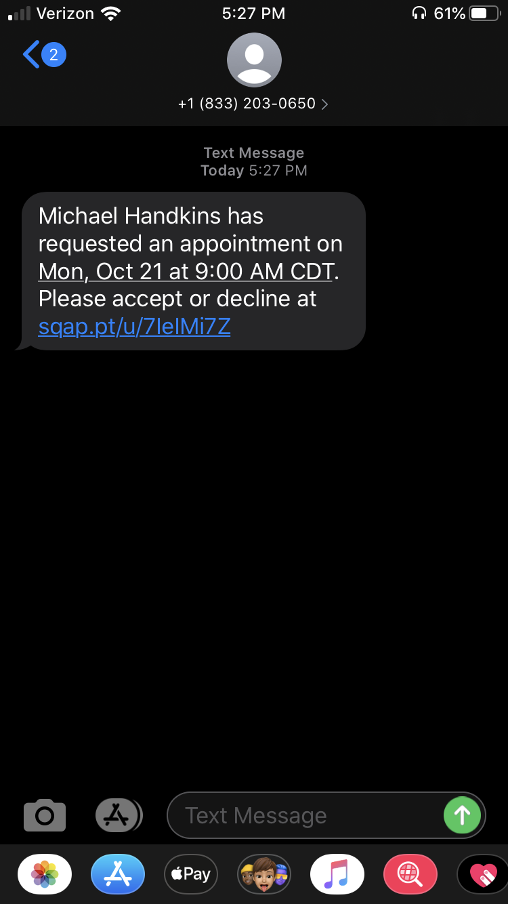
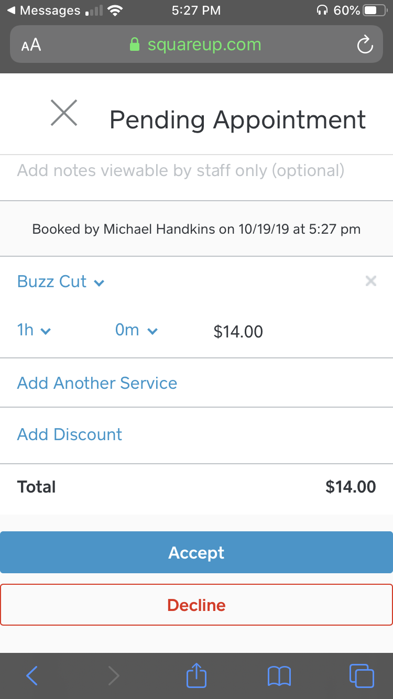

Once approved, the user will be notified that their booking has been accepted by the barber.

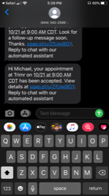

Every user will have access to the Dashboard. From the Dashboard users will be able to update their account settings.

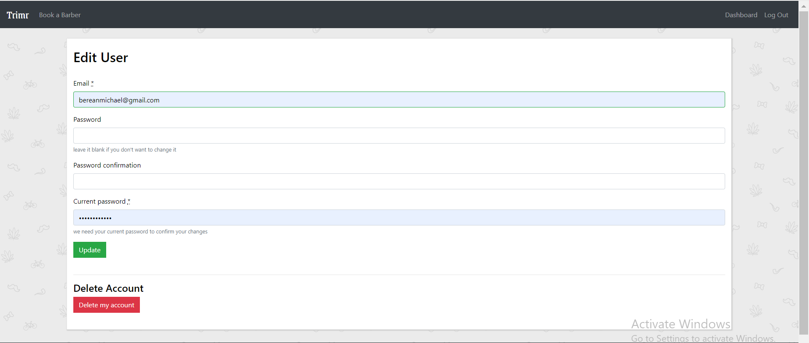

Users who are also barbers may update their barber info from the dashboard.

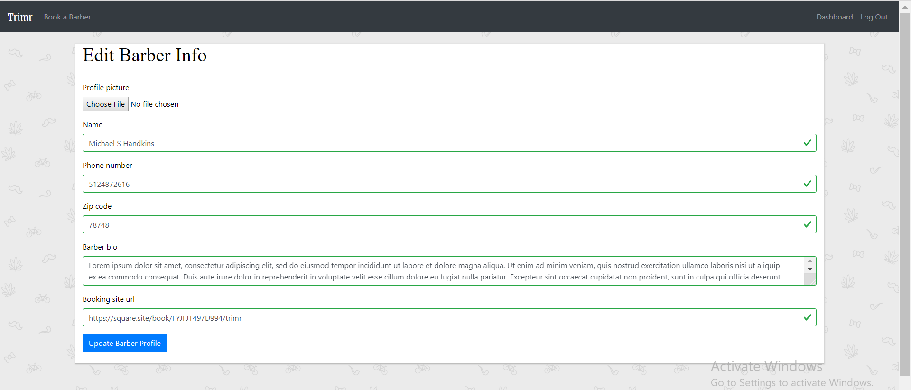

This site is deployed at https://trimr-handkins.herokuapp.com/

